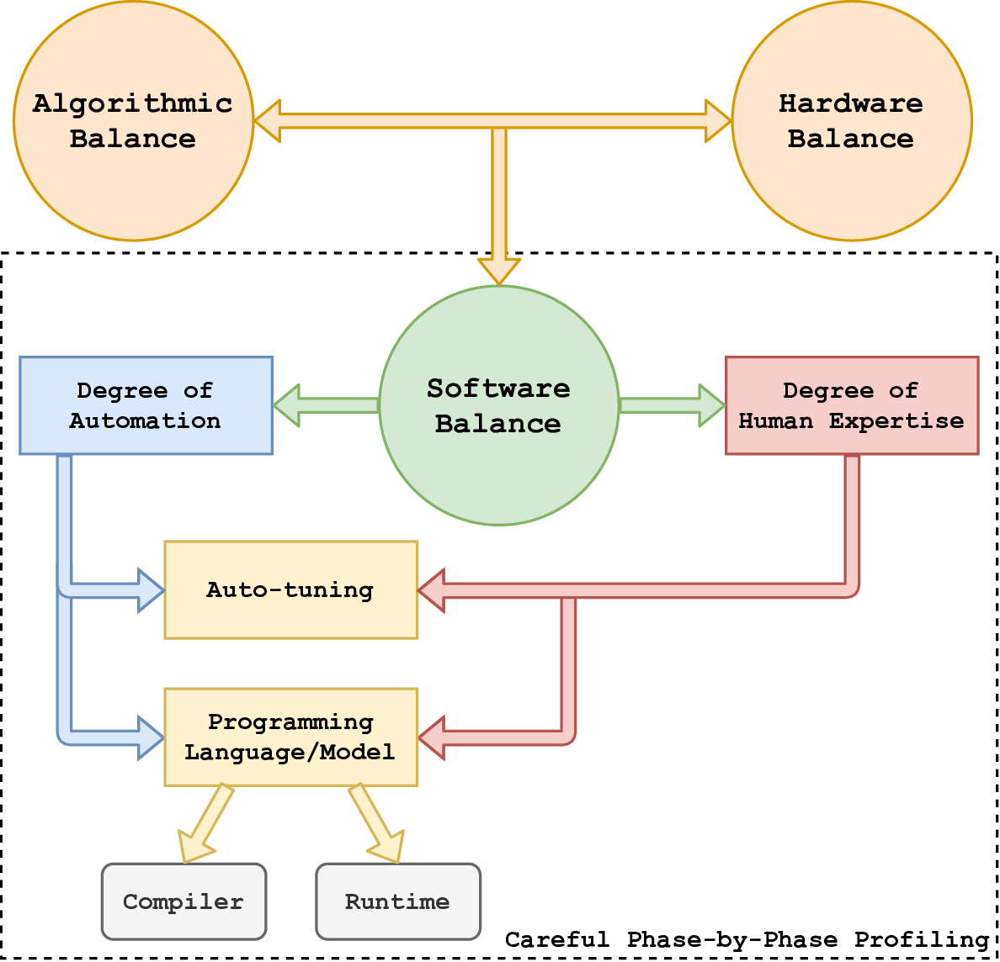

# KFUN3D [](https://badge.fury.io/gh/ecrc%2FKFUN3D) [](https://opensource.org/licenses/MIT) #
Unstructured Computations on Emerging Architectures

**KFUN3D** (https://ecrc.github.io/KFUN3D/) is an unstructured computational aerodynamics software system with irregular memory accesses, which is optimized and engineered on a wide variety of multi- and many-core emerging high performance computing scalable architectures, which are expected to be the building blocks of energy-austere exascale systems, and on which algorithmic- and architecture-oriented optimizations are essential for achieving worthy performance. KFUN3D investigates several state-of-the-practice shared-memory optimization techniques applied to key computational kernels for the important problem class of unstructured meshes, one of the seven Colella “dwarves,” which are essential for science and engineering. It illustrates for a broad-spectrum of emerging microprocessor architectures as representatives of the compute units in contemporary leading supercomputers, identifying and addressing performance challenges without compromising the floating-point numerics of the original code. While the linear algebraic kernels are bottlenecked by memory bandwidth for even modest numbers of hardware cores sharing a common address space, the edge-based loop kernels, which arise in the control volume discretization of the conservation law residuals and in the formation of the preconditioner for the Jacobian by finite-differencing the conservation law residuals, are compute-intensive and effectively exploit contemporary multi- and many-core processing hardware. KFUN3D therefore employs low- and high-level algorithmic- and architecture-specific code optimizations and tuning in light of thread- and data-level parallelism, with a focus on strong thread scaling at the node-level. The approaches are based upon novel multi-level hierarchical workload distribution mechanisms of data across different compute units (from the address space down to the registers) within every hardware core. These optimizations are expected to be of value for many other unstructured mesh partial differential equation-based scientific applications as multi- and many-core architecture evolves.

## The Original NASA FUN3D Code ##

KFUN3D is is closely related to the export-controlled state-of-the-practice FUN3D (https://fun3d.larc.nasa.gov/) code from NASA used to analyze the low-speed and high-lift behaviors of an aircraft in take-off and landing configurations. FUN3D is a tetrahedral, vertex-centered, unstructured mesh research code written in FORTRAN for solving the Euler and Navier-Stokes equations of fluid flow in incompressible and compressible forms. It was originally developed in the early 1990s under the direction of W. Kyle Anderson at NASA Langley Research Center.

## PETSc-FUN3D ##

PETSc-FUN3D is a research fork of the incompressible and compressible Euler subset of the original FUN3D code that was restructured to employ Portable, Extensible Toolkit for Scientific Computation (PETSc) solver framework (https://www.mcs.anl.gov/petsc/) for the study of distributed-memory scaling. PETSc-FUN3D performance is thoroughly discussed, analyzed, and modeled in [1], which culminated in the 1999 Gordon Bell Special Prize undertaken jointly by the primary architect of FUN3D and members of the PETSc development team, which ran on the world’s then most powerful supercomputer, the Intel ASCI Red machine at Sandia.

<p align="center">
  
</p>

### Requirements ###

* C/C++ Compiler (e.g., **GNU C/C++ Compiler** -- https://www.gnu.org/software/gcc/)
* METIS (http://glaros.dtc.umn.edu/gkhome/metis/metis/overview)

The repository includes **METIS**, and the default Makefile links to it. Thus, you may not need to install yours, you can just use the one that is already included herein. However, if you have a better installation that you wish to link to, just install it on your software environment and directly link to it.

Having said that and since the repository already included the required external library, the minimum requirements to run KFUN3D are:

* C/C++ Compiler (e.g., **GNU C/C++ Compiler** -- https://www.gnu.org/software/gcc/)

Please have the dependency configured and installed on your system before running the code.


## Compiling and Linking ##

Edit the makefile to include all of your installed dependencies. The default ones are set to GNU GCC compiler. If you have the compiler configured and installed on your system, then you may not need to edit the makefile. Anything that you do not want to include in the make, just comment it out. Once you edit the makefile file, you can just do:

```bash
make clean
make all
```

`make` should generate an executable binary file called: **kfun3d.out**. You can run it directly with `./kfun3d.out -m <Mesh_Dataset<A|B|C|D>> -t <number_of_OpenMP_threads>` executable command. The mesh datasets are located in the **mesh/** directory: *A|B|C|D*, each one has different sizes. Note: The only provided meshes in this repository are A and B, due to size constraints. However, the rest of the meshes can be requested by contacting us.

### Running Test Cases ###

To give you a flavor of the excepted outputs, you can use: `make test_A` and `make test_B`, for parallel execution with Mesh A and B, respectively.

## Tested Architectures ##

Here is a list of the systems in which we ran KFUN3D.

* Intel Skylake Scalable Processor Server [56 Cores (dual-socket)]
  * Intel Parallel Studio 2019
  * Used the repository provided library for METIS
* Intel Knights Landing Server [72 Cores and 64 Cores]
  * Intel Parallel Studio 2019
  * Used the repository provided library for METIS
* Intel Haswell Server [36 Cores (dual-socket)]
  * Intel Parallel Studio 2019
  * Used the repository provided library for METIS
* Intel IvyBridge Server [20 Cores (dual-socket)]
  * GNU GCC version 8.3.0
  * Used the repository provided library for METIS
* Intel SandyBridge Server [16 Cores (dual-socket)]
  * GNU GCC version 8.3.0
  * Used the repository provided library for METIS
* AMD EPYC 7601 [64 Cores (dual-socket)]
  * AMD AOCC version 1.3.0
  * Used the repository provided library for METIS
* ARM Cavium ThunderX2 [64 Cores (dual-socket)]
  * Arm C/C++ Compiler version 6.12
  * Used the repository provided library for METIS

## High-level Abstraction of Hardware and Software Co-design Ecosystem ##

<p align="center">
  
</p>

## Contact ##

* mohammed.farhan@kaust.edu.sa

## License ###

MIT License

## Acknowledgments ##

Support in the form of computing resources was provided by KAUST Extreme Computing Research Center, KAUST Supercomputing Laboratory, KAUST Information Technology Research Division, Intel Parallel Computing Centers, Isambard Project at University of Bristol, CUDA Center of Excellence at KAUST, Blue Waters Supercomputer at University of Illinois at Urbana-Champaign, and Cray Center of Excellence at KAUST.

## Papers ##

[1] W. D. Gropp, D. K. Kaushik, D. E. Keyes, and B. F. Smith, *High-performance parallel implicit CFD*, Parallel Computing, vol. 27, no. 4, pp. 337–362, 2001, Parallel Computing in Aerospace.

[2] M. A. Al Farhan and D. E. Keyes, *Optimizing Unstructured Grid Computations for Emerging Architectures*, To be submitted, 2019.

[3] M. A. Al Farhan, *Unstructured Computations on Emerging Architectures*, [PhD Dissertation, KAUST,] 2019. http://hdl.handle.net/10754/.

[4] M. A. Al Farhan and D. E. Keyes, *Optimizations of unstructured aerodynamics computations for many-core architectures*, IEEE Transactions on Parallel and Distributed Systems, vol. 29, no. 10, pp. 2317-2332, 2018.

[5] M. A. Al Farhan, D. K. Kaushik, and D. E. Keyes, *Unstructured computational aerodynamics on many integrated core architecture*, Parallel Computing, vol. 59, pp. 97–118, 2016, Theory and Practice of Irregular Applications.
